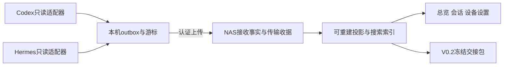

# 跨 Agent 工作台工程执行规格 v0.2

本文件补充并在明确冲突处覆盖原PRD。文中的 MUST/必须是本产品设计约束，不是对现有Codex/Hermes接口的断言。产品尚未开发，命令、表、API均为待实现契约。

## 1 范围与架构

V0.1：单用户；Windows与Mac；覆盖用户实际使用的Codex/Hermes入口；NAS部署中心与网页。必要的三栏活动回看、中文搜索、基础路径映射和复制路径进入V0.1。V0.2增加上下文交接与文件版本核验。V0.3增加资源采样。高级远程控制、自动摘要、AI标签、价格抓取、账号额度、MCP和额外Agent都不进入V0.1。

保留React+TypeScript前端、Python+FastAPI服务/采集器、SQLite+FTS5方案。前端构建产物由后端同源提供；中心单Uvicorn worker；一个串行写入队列，读连接短事务；不用Redis等外部服务。Python采用支持当前依赖的稳定3.12+版本，P0固定补丁版、依赖锁和SQLite实际运行版本。SQLAlchemy 2 + Alembic管理中心模型/迁移；Pydantic 2作为API输入/输出类型源；输出OpenAPI并生成前端类型。采集器独立SQLite outbox可使用stdlib sqlite3。

源码在新的独立仓库创建，建议目录延续原PRD的collector/server/web/shared/tests/deploy/docs。包管理使用uv与pnpm，各自提交锁文件。不得在当前DraftDock仓库拼入新产品。

采集器按OS/架构在对应CI runner打包，自启动使用macOS LaunchAgent / Windows用户登录任务；Windows在WSL运行Agent时，在对应WSL环境运行独立采集实例，归入同一物理设备的不同environment。安装包必须包含诊断、启停、自启动安装/卸载和日志路径说明。第一版无需托盘。

## 2 来源探针与适配器契约

### 2.1 逐来源能力报告

每一个实际的“设备×环境×Agent×Profile×入口”单独登记，不按OS粗略合并。能力状态统一为 `unverified | supported | estimated | missing | incompatible`；每项包含reason、verified_version、evidence_refs、last_verified_at。未实测即unverified，不能因为官方文档有接口而标supported。

capabilities至少记录：agent_version、executable_path、execution_surface、resolved_home、profile、adapter_version、schema/protocol结构指纹、历史读取范围、运行事件覆盖、稳定原生ID、时间字段及精度、usage粒度与语义、model依据、子任务/辅助请求是否覆盖、正文/工具/附件覆盖、文件证据、资源关联、读取权限、解析失败计数。

Codex：先测试安装版支持的只读历史接口及落盘记录。`thread/read`不代表订阅；单独启动服务器的内存线程不代表当前桌面所有会话。不要调用thread/resume来冒充只读探测。能导出安装版协议schema则保存为fixture依据；实验接口不得成为唯一历史入口。落盘JSONL解析器按格式特征与版本隔离，未知字段保留、未知格式告警。

Hermes：按配置/Profile和官方路径解析规则读取state.db，不实例化会自动迁移的SessionDB。Windows默认位置与Unix可能不同，禁止只写死~/.hermes。探测表/列/主键/索引结构，不仅检查schema_version整数。完整正文可能存在content之外的结构化消息字段；active/compacted等状态不得简单当“应删除”。`session_model_usage`按多个计费维度累计，不能与sessions累计总量再相加，也不能因有first_seen/last_seen就生成逐请求账本。

### 2.2 适配器函数职责

| 方法 | 输入与输出约束 |
| --- | --- |
| discover(config) | 仅扫描明确Agent根目录；返回来源候选，不读取凭据/整个用户盘 |
| probe(source) | 版本、结构与样本覆盖；不修改源库、不注册Hooks |
| scan(cursor, limit) | 有界读取，输出source facts、下一游标、缺口和原始定位；半行不提交游标 |
| normalize(fact) | 转为事件信封；每个推断有rule_id；不能补零或改写原始日期 |
| reconcile(source) | 增量状态核对、轮转/截断检测、补扫；不能删源文件 |
| export_diagnostic() | 版本、字段、计数和错误；默认不含正文/密钥 |

每个来源只有一个主观察者负责无原生修订号的排序。镜像观察者复用原始身份，不能独立生成“更新优先级”。主观察者接管需要显式来源绑定和新观察代际。

JSONL：只消费以换行完成、可完整解析的记录；保存文件代际/稳定流ID、位置和末段指纹；轮转后核对原生键再扫描。SQLite：`mode=ro`短读事务，包含已提交WAL；不用immutable访问活动库，不复制单独热.db，不对源库执行DDL/PRAGMA修改。读取锁失败有界退避，不阻塞原Agent。

初次导入默认全历史，可选择时间范围；先索引来源清单，再优先最近7天与新增数据，历史单批补齐。发现能力变化后冻结受影响的投影，保留原始输入和错误，不把解析失败显示为空历史。

Hooks仅作为P0证明必要后的可选补采安装步骤。不能静默改变用户Agent配置。Codex Stop不必然是最终终止；Hermes on_session_start/end不是对称的逐轮起止；所有映射须以具体入口fixture证明。Hooks只能快速写本机队列，不在Hook里联网等待或向模型注入统计指令。

## 3 身份、事实与数据库约束

### 3.1 身份

所有本工具登记ID用UUID；设备改名不换ID。物理设备、运行环境、Agent来源、观察采集器分别登记。`source_instance_id`表示原始数据谱系及Profile，`collector_id`表示谁观察，不能互相替代。安装重建不默认接管旧设备；用户可选择重新绑定，旧身份保留映射记录。

`session_id`由(source_instance_id, native_session_id)唯一确定，另有本工具UUID。`run_id`由同一source/session下的native_turn_id确定；只有适配器证明边界时才能使用稳定派生ID。收到追加输入不自动新增run。跨机延续的新native_id为新session，以continuation链接关联；任务关联不改变统计事实。

执行设备只依据来源执行元数据、已证明本机运行的实时实例或显式人工确认。仅因文件在本机就推断历史在本机执行不成立。`execution_device_id=null`进入unknown桶。云端与远端单独environment；从Windows查看/远控Mac不会增加Windows的历史用量。

已证明同源的镜像沿用source_instance_id。未证明同源但有重复原生session/request键的候选进入待核对覆盖组，暂不把候选量加入已确认总量；页面展示候选数/候选用量，不因文本相同自动删除，也不假装它已归属。

### 3.2 事件与修订

事件append-only。稳定身份输入为 `[schema_major, source_instance_id, native_session_id, fact_kind, native_fact_id, revision_key]` 的规范JSON；event_id为其SHA256十六进制。native_fact_id优先原生ID，其次验证过的数据库主键或稳定流中的记录定位，禁止单用正文哈希。完全相同文字的两次真实输入必须保留两次。

revision_key优先原生修订号；无修订号的不可变源行用`initial`；可变源行使用主观察者持久化的`revision_epoch + revision_seq`，内容指纹只用于判变。无变化重扫不得增加revision_seq；A→B→A是真实两次改变，生成三个不同版本，不与第一次A冲突。源事实修订注册表与游标/outbox同事务保存，镜像沿用其版本键。脱敏规则或解析器校正触发修订时同样生成新revision_seq并登记policy/rule版本。丢失修订注册表且源无原生历史时不能猜回旧序列，应登记修订历史缺口并经来源重绑定后建立新代际。规范JSON使用UTF-8、键排序、无空白分隔、不转义非ASCII、拒绝NaN/Infinity；数值只允许整数，费用等小数采用十进制字符串，避免跨语言浮点散列不一致。

body_hash为信封的content对象规范JSON哈希。观察者、接收时间、传输序号、源文件当前绝对路径均放传输元数据，不参与事实身份或body_hash。event_id相同且body_hash相同即duplicate；相同ID不同body_hash是冲突，不能覆盖。

正常消息修订产生新event_id，content.supersedes_event_id引用上一版本，且必须属于同一事实作用域。投影优先原生版本/序号，其次已登记主观察者顺序，不能按接收时间排序覆盖。并列或无从确定顺序时保留分支和冲突状态，暂停该事实的确定统计。解析器修复必须使用明确的correction修订和原因，重建投影；不能把规则变化伪装成源Agent新活动。

`schema_version=1`仅允许本规格事件类型；新增可忽略字段只能小版本兼容，大版本不支持则拒绝且不确认。安装版、适配器版本和projection_version分别记录。

### 3.3 内容payload最小要求

所有ID、质量、nullable字段按contracts/event-envelope.schema.json；各类型payload在P0以Pydantic判别联合固化，生成JSON Schema/OpenAPI，以下字段/语义必须落实。

| fact_kind | payload必需字段与规则 |
| --- | --- |
| session.observed | native_session_id、title可空、created_at可空、cwd可空、parent/fork信息可空；空不能覆盖已知高质量值 |
| message.observed | native_message_id、role、input_origin、content_state、source_text_char_count可空、native_turn_id可空、finalized、inherited_from可空；content_state=full/redacted时body或body_ref二选一，stats_only/source_only/missing时两者都不传且必须有omission_reason；只最终消息计字符 |
| run.observed | native_turn_id、status、start_at/end_at可空、start_basis/end_basis、parent_run_ref、duration_ms可空、duration_basis、model_attribution；终态修订需显式引用 |
| usage.observed | usage_key、quantity_semantics、coverage_scope、model/provider可空、input/output/cached/reasoning可空、counter_id/epoch可空、source_time/period可空、included_children；只对已证明cumulative_consumption求差 |
| file.observed | native_file_event_id、native_path、cwd、root_ref可空、relation、operation_status、run_ref可空、size/mtime/hash可空、checked_at可空、evidence_refs |
| gap.observed | scope、reason、from/to可空、recoverability、evidence_refs；缺口本身不得有假造的消息/用量 |

role为user/assistant/tool/system/developer/unknown；input_origin为human/automation/handoff/inherited/unknown。content_state为full/redacted/stats_only/source_only/missing，后3种不得当真实空文本、不得进入正文索引或伪装完整交接；可保留本地按规则计算的source_text_char_count。run状态为running/waiting/completed/failed/cancelled/unknown；stale由新鲜度派生，不是虚构的源终态。quantity_semantics为request_delta/cumulative_consumption/context_occupancy/unknown；coverage_scope至少区分self/with_children/aggregate/unknown。文件relation为created/modified/read/referenced/discovered，只有明确成功操作能进入created/modified计数。

### 3.4 最小关系模型

| 表 | 主键/唯一约束与主要内容 |
| --- | --- |
| devices/environments/collectors | UUID；environment绑定物理设备；collector绑定环境、token权限与状态 |
| source_instances/source_capabilities | source UUID；Agent/Profile/来源谱系/主观察者；能力版本及证据 |
| events | event_id PK；body_hash、content、源排序、修订引用；不可变 |
| deliveries | UNIQUE(collector_id,outbox_epoch,outbox_seq)；event_id、body_hash、receipt_status、server_received_at、隔离原因 |
| source_observations | delivery引用、source_locator、observed_at、adapter_version；支持同事实多个观察者 |
| sessions/messages/message_versions | UNIQUE(source_id,native_id)及版本键；原始内容/继承引用和独立用户展示元数据 |
| runs/run_versions | UNIQUE(session_id,native_turn_id)；设备、边界、终态、依据、父轮次、版本 |
| usage_observations/usage_ledger | 原始观测与有效账目分离；ledger唯一coverage_key+derivation_version；来源清单、金额/Token及归属 |
| activity_segments | session+分段版本；开始/结束、锚点，完全可重算 |
| workspace_roots/path_maps/files/file_events | 逻辑根+相对路径唯一性按根策略；物理位置与操作证据分别存 |
| blobs | 内容SHA256、长度、内容类型、引用计数、访问范围与校验状态 |
| preferences/annotations | 时区、用户标题、归档、备注；不改源消息 |
| tombstones/policy_versions/security_journal | 删除/排除/撤销范围与版本；恢复时优先应用 |
| projection_checkpoints/jobs | 接收、投影水位与投影版本；重建进度、错误、取消状态 |

V0.2追加handoffs/handoff_artifacts/session_links；V0.3追加processes/resource_samples。共享的数据类型先生成，不一次实现所有后续表。

外键开启；所有引用可为空的情形明确区分“尚未到达”与“来源不存在”。乱序事实可先入events，投影等待依赖；不能因session未先上传就丢掉run。必要索引覆盖source/native身份、session+source_order、run起止、execution_device、Agent、usage归属时间/模型、deliveries唯一键。日聚合只是缓存，不能成为唯一账本。

中心与outbox均使用本地卷。应用启动验证SQLite运行版本与FTS5/trigram能力；优先采用已修复WAL-reset问题的SQLite版本（3.51.3+，或官方明确列出的3.50.7/3.44.6修复分支），锁定实际发行版本并记录。只用本应用验证过的组合，不修改源Agent附带SQLite。

## 4 统计契约

### 4.1 通用查询

时间存UTC毫秒；报告日期默认Asia/Hong_Kong，用户可改IANA时区。查询区间为`[from,to)`，每个当地自然日边界单独转换为UTC，不假定一天总是86400秒。筛选维度之间AND，同一维度多选OR；unknown是可显式选择的桶。

返回值均带`metric_id, value, unit, quality, basis, included_count, excluded_counts, denominator_scope, evidence_query, as_of, projection_version`。质量为recorded/derived/estimated/partial/unknown/conflict；精度依据与覆盖程度可分别记录，不能一个标签掩盖两者。

确定没有活动且该查询窗口的来源扫描已成功覆盖时可显示0；源未接通/历史未覆盖或值不可得时显示NULL和原因。全局total允许“已确认值＋未核验/未分配部分”，但不得把已确认部分标作完整总量。

### 4.2 时间与轮次

累计响应时长：查询窗口内**边界可信且终态为completed/failed/cancelled的顶层轮次**的区间交集长度之和。包含工具、审批和排队的响应等待，故UI必须称“轮次响应累计时长”，不能称CPU工作时间或人工投入。子轮次不再加进父级总量；可独立查看其明细。

并行去重时长：对同一集合所有交集区间排序合并后求长度。跨设备重新求并集，不能把分设备并集相加。running/waiting/stale不进已结算主卡，作为“当前未结算活动”独立显示；失败/取消时长有可见子计数。

平均/中位数/P95：只取start_at落在查询窗口、边界可信、completed顶层轮次的完整duration；跨日轮次全部归开始日用于这些分布统计。P95采用nearest-rank，索引ceil(0.95*n)，中位数偶数取中间两数平均。n=0返回NULL。均值不能用“当日切分累计时长÷新开始轮数”。

当天新开始轮数按start_at；当天有活动轮数按可信区间交集或已记录交互；两者分开。字符数按消息发生时刻，与轮次平均的开始日规则不混用。

duration优先原生经过验证的elapsed/单调时钟。若它与UTC端点差相差超过max(2秒, duration的1%)，标clock_anomaly：轮次可展示原生elapsed，但跨设备/按日时长主卡不将其当成可信时间定位；进入待定位时长。不同设备时钟误差上界无法确认或超过2秒时，全设备并行去重标estimated/partial；单机elapsed仍可recorded。2秒是本产品设计阈值，不是Agent保证。

设备时钟偏差通过心跳往返估计（保留RTT和误差范围），只能告警，不能静默改写事件时间。长离线数据不能靠上传时的时差精确修正；无偏移证据保留不确定性。

历史仅有用户消息与助手结束文本时，可在详情显示`message_window_v1`估算区间：同一可证明轮次内用户消息到最终助手消息，且没有已知交叉/缺口；无法证明轮次边界则仅显示消息跨度。任何此类估算都不进入精确主卡和完成均值。

覆盖率分母限“已发现、查询窗口内符合业务筛选的顶层轮次”；完成耗时覆盖率=有完整可信耗时的completed轮次/已发现completed轮次。另显示已发现总轮数、未终止轮数、来源历史覆盖范围。不能声称覆盖了源端从未采集到的全部轮次。

### 4.3 活动片段

在同一session内按活动排序；前一执行区间结束到下一条用户交互/执行开始空闲≥30分钟时新建片段，正好30分钟也分段。单个仍在运行的长轮次不因30分钟而切开；无结束证据时按消息做“交互片段”，依据标明。分段按全会话计算后与日期窗口相交，不能每次查询重造session或run。阈值变更只重建展示投影。

### 4.4 字符与模型筛选

输入字符遵循原PRD：最终提交的human消息，CRLF归一为LF后按Unicode码点计数；含空格标点，不计附件字节/系统/工具。保留line ending规范化说明，不做NFC/NFKC改写原文。JS用`Array.from(text).length`等码点方式，不用UTF-16的length。继承/交接/automation单列；来源unknown不混入“手写字符”。同轮追加两条输入是两条消息，不自动变成两轮。

无模型筛选时，时间/轮数/字符正常按各自业务集合统计。选择模型时：Token按可归属的request或计数器维度；轮次时长、轮数与其关联字符仅纳入能证明整轮唯一模型且被选中的轮次。混合/不明模型轮次另列数量和已知整轮时长，并允许下钻，不能填0或按Token比例分摊。即使同时选中A/B，也不把混合轮次伪装成单模型可归属；查看全模型恢复完整时间卡。

有请求span时可额外展示“模型请求耗时”，按请求计，不与轮次响应时长混用。请求重叠时同时保留sum/union语义。模型分组的时间列不能默认加总为全站响应时长。

### 4.5 用量账本

优先使用可核验的逐请求消费。相同请求的多层观察只形成一笔有效账目；父级含子级累计不能和子级重复相加。无请求ID但能证明覆盖区间/作用域的aggregate只作对账：优先明细，不能将aggregate与明细同时计入。无法判断重叠则把整组标pending_overlap，展示各观察值但不纳入已确认总量。

input/output是可相加的顶层消费维度；cached_input若已包含于input、reasoning_output若已包含于output则只是子集。逐字段NULL不转0，缺一个顶层维度时总Token标partial而不是称为完整总量。费用用decimal字符串和ISO币种；不同币种不求和；actual/estimated分栏，V0.1不自动抓价格估价。

只有明确`quantity_semantics=cumulative_consumption`且counter_id、epoch、维度和顺序稳定时才能差分。context_occupancy不是消费计数器。counter维度至少包含来源、session、model、provider、billing_mode、task_scope；具体维度以源定义为准，未知维度不能假定相同。

第一份累计快照保留为历史基线，日期未分配；只有明确epoch从0开始且起点时间已知，才能把首值当该窗口新增。相邻有效快照差值对应`(previous_source_time,current_source_time]`，按原生顺序计算，不能按received_at排序。

归日优先：request时间→request开始日；只有已证明轮次归属→turn开始日并标turn_attributed；只有计数器区间→区间全部处于同一报告日且时间可信时按counter_interval归日；跨日差值保留带范围的“跨日未分配”，不均摊也不归后一快照日。快照采集时间只有在探针证明代表当时计数器状态时才能构成区间端点，源库字段last_seen不能未经验证替代。

source_order乱序到达后重建受影响链，旧的派生差值被替换，不新增另一笔消费。回退必须有明确reset/epoch及基线证据才开启新代际；否则隔离异常边，保留最后可信累计和缺口，不执行max(delta,0)后继续记账。缺中间快照仍可得到跨区间增量，但不会因此获得细粒度每日分布。

分叉有明确祖先/继承基线时，继承消息与历史用量不重记；只计新请求或可证明增量。读历史引发的新请求是新消费，正常记账。无继承证据不能仅按同文本或同标题去重。

界面同时给：时间窗口已归属用量、相关会话/计数器的未分配用量及跨度、未核验重叠量。未分配余额不在每一日重复显示为当日新增，也不在日趋势中画0假装全覆盖。可确定作用域下的会话累计=已分配+未分配；跨作用域未知重叠不强求相加。

账号额度若未来接入，独立account/provider/plan窗口快照建模，两台设备看到同账号余额只展示一次，不进入消费账本，不由Token推算。

## 5 同步、持久化与异常恢复

### 5.1 本机状态机

采集器先在同一个本地事务中“持久化规范事件+outbox记录+推进源游标”，再尝试联网。提交前崩溃则不推进游标，提交后崩溃则队列可重发。不得先改游标再写队列。

每个采集流使用`collector_id + outbox_epoch(UUID) + outbox_seq(从1开始递增整数)`。source_order是源事实顺序，outbox_seq是传输顺序，两者不能混用。序号重复内容不同是传输冲突，换batch_id也不能绕过去。数据库重建生成新outbox_epoch，但同源event_id保持可去重。

默认每10秒或达到200条/1MiB即上传，先到为准；压缩后的请求也限制解压体积。失败指数退避1/2/4/8…最高60秒，加入±20%抖动；离线不刷满日志。历史导入低优先级，实时增量优先但不改传输序号含义。服务端可接收有空洞的批次，连续ACK仍等待空洞。

### 5.2 服务端收据与水位

服务端一次事务持久化批次各项的事实/观察、传输收据及可隔离错误，commit成功后才响应。可处理的记录允许部分接受；不符合整体认证/协议/体积要求的请求整批拒绝、不确认。收据状态如下：

| status | 持久化与重试规则 |
| --- | --- |
| accepted | 新事实与收据已提交，可确认；未必已投影 |
| duplicate | 相同event_id和body_hash已有事实，本次观察/收据已提交，可确认 |
| ignored_tombstoned | 删除/排除范围命中，只保存最小拒绝收据，不重新保存敏感正文，可确认 |
| quarantined_pending | 语义无效/身份冲突的内容及原因已隔离；暂不可越过此序号推进连续ACK |
| quarantined_resolved | 客户端已持久化deadletter并显式提交处置收据，中心保留可诊断隔离记录，可越过；不计入统计 |
| retryable | 未完成持久化，重试；不得用于推进ACK |

隔离解决流程：客户端收到quarantined_pending → 在本机保存原记录、原因、body_hash和receipt_id → 调用`POST /v1/ingest/quarantines/{receipt_id}/resolve`，提交`action=retain_locally_and_skip`及同一body_hash → 中心标resolved并计算连续ACK。此操作只隔离坏记录，不视为修复原数据。UI持续显示缺口，后续修复提交新修订事实。若客户端崩溃前没有保存deadletter，不发送resolve。

`durable_ack_seq`是连续已处理前缀，仅允许accepted/duplicate/ignored_tombstoned/quarantined_resolved。已有1/2/4而缺3时ACK=2；4可在离散receipts中显示持久化，但不能令客户端批量删除1..4。大于连续ACK的逐项收据可缓存以减少重发，但仍保留本机恢复副本。

`projected_ack_seq`是投影已处理的连续前缀，不能超过durable_ack_seq；被隔离/排除的序号有已知处置，可越过，但响应必须给excluded计数。投影进度不代表所有来源历史完整。客户端显示接收、索引、隔离数与来源覆盖分开。

响应丢失后原样重传；服务端幂等返回收据。batch_id用于请求追踪，同batch_id不同body返回409；幂等的最终保障是delivery键和event_id，不只靠batch_id。

### 5.3 心跳与可见状态

每30秒心跳，独立携带collector存活、各source.last_scan_success、source_errors、当前游标、outbox_pending_count/bytes、last_event_at、时钟估计。超过90秒未心跳标stale；10分钟标offline。阈值可配置。设备在线但来源解析失败时，来源必须单独显示失败。

“最后活动”不等于“扫描到哪里”；没有新事件时成功扫描仍刷新扫描时间。页面轮询5秒，隐藏页30秒或暂停；全链路30秒可见延迟为在线目标，不能单看HTTP上传耗时宣称满足。

恢复连接后按原occurred_at重建历史；received_at只用于同步诊断。来源截断、压缩、丢日志或未知schema生成gap，不静默把最新游标当完整历史。

### 5.4 大文本与容量

信封内body UTF-8不超过64KiB。更大正文使用`body_ref={sha256,bytes,media_type}`引用。先提交受限blob上传意图，包含source_instance_id、native_session_id、policy_version、hash、bytes、media_type；中心在接收正文前核对来源权限、墓碑和内容策略，返回绑定该作用域、5分钟有效的upload_id。随后流式上传、校验SHA256并原子完成，再上传引用事件。`PUT /v1/blobs/{sha256}?upload_id=...`幂等，最大64MiB，超限413并产生source_only/too_large缺口；原文本地保留并可说明如何访问，不静默截成完整正文。upload_id不放公开链接，日志需脱敏。未完成临时blob不能被查询；正常无引用孤儿blob7天后清理。

正文提交完成和引用事件入库时都再次检查策略；删除/排除发生在上传中途时撤销对应意图，停止或丢弃staging，清除该会话的孤儿引用，不能依赖7天GC才生效。相同hash也必须登记合法scope，不能知道hash就绕过授权。若blob仍有其他未删除会话的合法引用，只清除被删除范围的引用并在删除说明中列明共享副本；不声称已销毁全站每一份相同文字。

断流可整blob重试，V0.1不要求断点分块协议；按流处理，不把整个64MiB读入内存。工具输出默认折叠、不全文索引；用户/助手的大文本正文索引按有界片段建立，注明索引范围。上传正文脱敏后计算body_hash，原文字符计数与脱敏后显示长度分别记录。

本机队列默认预算2GiB：达到80%告警并暂停历史回填，保留新增；达到上限停止推进源游标并告警，不丢未确认队列。若源日志在暂停期间被轮转删除，记录实际缺口。已ACK事件保留至少14天，受容量限制提前清理时需显示恢复保障降低；未ACK和未持久化处置的deadletter不得自动清理。恢复能否重放取决于队列保留及原日志可重读，不做无限保证。

## 6 API契约

API路径前缀`/v1`。UTC ISO8601输出必须含Z；空值明确null。列表默认50、最大200，使用稳定排序键+ID的opaque cursor，并绑定筛选哈希及projection_version；版本不匹配返回`409 cursor_stale`，前端重载且保留选中锚点。查询默认不返回全部工具日志。

统一错误：`{error:{code,message,retryable,details},request_id}`。401认证失效；403权限不足；409身份/状态冲突；413体积超限；422协议/参数不符；429带Retry-After；503可重试。错误中不能泄漏令牌、原文或主机绝对路径。

| 接口 | 关键输入/返回 |
| --- | --- |
| POST /auth/login; POST /auth/logout; GET /auth/me | 单用户网页登录；安全cookie；失败限流 |
| POST /v1/pairing-codes | 已登录owner生成10分钟单次码；只返回一次 |
| POST /v1/devices/pair | code、物理设备/环境信息；返回collector_id、source登记范围、仅写token、server_epoch |
| POST /v1/sources/register | 采集token，仅绑定获授权的来源；镜像/接管需owner确认来源映射，不按标题自动合并 |
| POST /v1/ingest/batches | batch_id、collector_id、outbox_epoch、entries[{seq,observation,event}]；返回逐项receipts、durable_ack_seq、projected_ack_seq、server_epoch |
| POST /v1/ingest/quarantines/{receipt_id}/resolve | 只允许原采集器提交匹配hash的本地保留处置；幂等 |
| GET /v1/ingest/checkpoint | 采集流身份；返回持久/投影水位、缺口范围、server_epoch，禁止读其他来源正文 |
| POST /v1/collectors/heartbeat | 本机/来源健康、队列、扫描水位；返回server_time及配置策略版本 |
| POST /v1/blob-upload-intents | 采集器提交来源/session/policy/hash/bytes；先校验墓碑和策略，再发短期scope绑定upload_id |
| PUT /v1/blobs/{sha256}; GET /v1/blobs/{sha256} | 写入必须带合法upload_id并重查策略；读取仅owner或限范围导出授权，不靠知道hash获得正文 |
| GET /v1/health/sources | 登录后查看心跳、扫描、接收、投影、队列、能力/缺口 |
| GET /v1/stats | from、to、tz、device_ids、agent_ids、model_ids；返回统一metric对象和未分配/混合模型说明 |
| GET /v1/stats/contributors | 同一过滤+metric_id+projection_version；返回组成主卡的ledger/run引用、excluded原因；可与主卡对账 |
| GET /v1/sessions | 默认activity_from/to，而非created_at；带同组筛选与cursor；返回片段摘要和原生来源 |
| GET /v1/sessions/{id}/events | cursor或anchor_run/message_id，默认邻近50条；返回角色、证据、修订、缺口、前后游标 |
| GET /v1/search | q、日期/来源过滤、cursor；返回message/file锚点及查询限制；不返回任意源路径正文 |
| GET /v1/files/{id} | 映射路径、检查状态、证据与关联会话；只接受逻辑ID |
| POST/PATCH /v1/roots; PUT /v1/roots/{id}/maps/{environment_id} | owner配置逻辑根与路径；不自动扫描新授权之外目录 |
| PATCH /v1/sessions/{id}/annotation | 用户标题/备注/归档；不改源事实 |
| DELETE /v1/sessions/{id}/content | owner明确清理中心正文/衍生物，写墓碑；返回受影响交接包和备份失效期限 |
| POST /v1/handoffs; GET /v1/handoffs/{id} | V0.2，源session+截止点+目标environment；返回冻结manifest和授权下载 |
| POST /v1/handoffs/{id}/continuations | V0.2，已采集的目标session_id；显式建立边，保留多个分支 |
| POST /v1/file-checks | V0.2，owner指定target_environment_id、逻辑file_ids、stat/sha256操作、根映射版本与预算；生成10分钟有效任务 |
| GET /v1/collectors/jobs; POST /v1/collectors/jobs/{id}/result | V0.2，采集器只取本环境已授权的file-check；回传逐文件状态/size/mtime/hash/checked_at/错误；不能获得历史正文或执行任意命令 |

浏览器读接口全部需要owner会话；collector默认只有已授权来源写入/健康/自身checkpoint权限，V0.2可添加仅本环境file-check任务的领取/返回权限。镜像来源登记是owner操作，不能让窃取的某设备token冒充另一来源。请求中的collector_id与token绑定校验。

`stats`响应示意：`{filters, projection_version, as_of, metrics:[...], sources:[], unallocated_usage:[], mixed_model_runs:[], warnings:[]}`。分母为0用NULL覆盖率；requested_model/reported_model/configured_model不能混为一个真实模型字段，前端必须显示依据。

完整协议示例见contracts/ingest-example.json。开发在P0补齐payload判别联合和每端点OpenAPI，用本文件及schema生成contract测试。不要把本文件API误当成Codex/Hermes现有API。

## 7 页面与交互完成定义

导航只有总览、会话、设备与设置。V0.1白底浅灰分隔、单强调色；设备/Agent以文字+图标区分，不依赖颜色。设计是功能规格，不另做品牌官网。所有主流程支持键盘与可见焦点。

### 7.1 总览

顶部全局日期、设备、Agent、模型、报告时区；下方新开始轮数、累计响应时长、并行去重、human字符、Token五组主卡。每卡显示质量/覆盖摘要，点击打开同过滤、同projection_version的组成明细。混合模型、未知设备、未分配历史量都有明确入口。

中部每日时间线按设备/Agent/会话分组，执行区间实心、未知段明确标记，空闲留白；并列任务不能画为顺序。V0.1支持日期切换和点击轮次，复杂拖动缩放可后置。底部模型用量趋势和设备对比；不同币种/未知量不画成可加总同单位。

### 7.2 会话三栏

桌面≥1280px：左栏约280px可调，中栏自适应且≥480px，右栏约300px可收起；900–1279px右栏抽屉，<900px列表/详情切换。窄屏必须仍能访问文件和事件。

左栏选日期显示该日有活动的会话，可展开多个活动片段；默认以片段开始时间排序，标题显示用户覆盖标题或源标题，不以标题作为身份。中栏载入目标轮次及邻近消息，长会话虚拟/分页，工具默认折叠。右栏活动节点、用量、文件三页签；节点点击定位同一消息/轮次。

URL保存from/to/tz/device/agent/model/session/segment/anchor；页面刷新、浏览器后退保留选择和过滤。查看完整会话不抹掉原日期片段，返回仍回到查询上下文。所有“只存在于源平台压缩摘要”的文本标摘要；不能将其展开为伪造原文。

### 7.3 中文搜索

默认标题+用户/助手正文+项目名+文件路径。≥3 Unicode字符使用FTS5 trigram候选与字面子串核验；不把用户输入直接拼为FTS语法。1–2字符使用有日期/会话范围的参数化LIKE，默认最近30天并在输入框下明示；用户可以调整范围，候选上限10,000条、返回最多200条，SQL查询预算1秒，超限返回`query_too_broad`和收窄建议而非错误空结果。

所有通配符按字面意图转义，路径中的反斜杠不被当命令。搜索结果按命中消息时间倒序+ID排序，显示片段/日期/设备/Agent和锚点。工具正文检索先在单会话内提供，全文工具索引是后续选项。语义搜索与向量库不在范围内。

### 7.4 页面状态

每页必须具备：未配对、新来源导入中、加载中、确实无活动、部分历史、来源不兼容、设备离线、设备在线但来源失败、索引滞后、存在隔离记录、磁盘将满、认证过期。旧数据在错误时仍可读，除非认证已失效。缺失显示“未知/未采集/仅累计”，不是统一破折号或0。

数据源状态页展示四个不同时间：最后心跳、最后成功扫描、最后接收、最后投影；“已同步到…”必须对应具体来源水位与已知缺口。UI不能从last_event_at推断“源端没有活动”。

## 8 文件与路径

V0.1只记录有证据的文件关系、逻辑根、相对路径、设备路径和已知元数据，并允许复制目标设备路径。映射可由owner输入，不要求NAS挂载所有项目。浏览器没有经过验证的本机助手时，不提供声称能直接打开系统目录的按钮。

文件逻辑身份为root_id+相对路径，比较策略由根定义，保留原始拼写。设备物理副本另有location_id；同一个逻辑NAS文件多会话引用在逻辑汇总中计一次，真实副本体积按location另列。删除后同路径新建使用文件generation/版本证据区分；仅有路径无法确定时标身份不确定。重命名只有明确文件操作或内容/文件系统身份依据才能关联，不能全盘猜测。

相对路径拒绝绝对路径、`..`越界、空字节和根以外跳转；Windows路径按Windows规则解析，不让Linux服务把`C:\\`视为普通相对路径。映射时以完整路径组件匹配最长授权根，不用字符串前缀匹配。保留Unicode原始值，仅用于比较的规范形式由根设置，发现大小写/规范化碰撞时返回conflict，不自动覆盖。

源读取/文件检查发生在有访问能力的采集器或只读NAS项目挂载；解析真实路径后再验证仍在授权根，软链接/junction逃逸拒绝。文件接口不接受任意外部路径去读；本工具不成为NAS任意文件下载器。

存在性状态：unmapped / unchecked / exists / missing / inaccessible / offline / conflict。版本状态：unverified / metadata_match / hash_match / changed；size+mtime相同只能称metadata_match。V0.1可展示采集时元数据；V0.2交接按目标机器重新核验，不能把NAS可见当作Windows可读。

文件数量仅按created/modified等明确关系分别计数，一个文件十次修改=1文件、10操作。目录发现只计possible_related。磁盘标签用“逻辑正文大小/当前关联文件大小/共享存储”，不称可释放空间。原PRD的RAM、磁盘与context Token三个概念保持分离。

V0.2目录快照默认不递归所有NAS：只允许已选root及子路径，默认深度4、最多2000项、排除.git/node_modules/venv/build缓存，达到上限必须写truncated。文件哈希默认只对明确关联且≤20MiB文件按需执行；更大文件用户选择核验，显示工作量，不后台整盘哈希。参数是设计默认，可在实测后经决策记录调整。

目标文件核验走中心任务队列：owner创建file-check→目标采集器用现有主动连接轮询自己的任务→校验本机已登记root、map版本、操作白名单和字节预算→只执行stat或sha256→提交结果。文件路径由目标本机映射解析，服务端不能下发任意shell或未登记绝对路径。任务到期/目标offline保持unchecked/offline；重试和结果提交幂等，以job_id+file_id+map_version标识。结果写file_locations/file_checks，注明检查环境，绝不写成Mac源Agent的file.observed执行事实。NAS只读挂载检查只能证明NAS所在location状态。

## 9 V0.2上下文交接

### 9.1 冻结与导出

用户选择源会话、目标环境和可选截至轮次；服务端在一致读快照中固定projection_version与每来源水位，不以“最大时间戳”代表所有来源完整。当前持续流入的事实留给下一次导出；此次包内容不变。

生成顺序：冻结manifest → 选取可读正文/文件元数据 → 生成各文件 → 算SHA256 → manifest记录缺口和hash → 完成状态ready；失败为failed且没有半成品下载。内容blob采用不可变引用并在导出期间保留，生成过程不长时间占数据库读事务。

导出ZIP目录：handoff.json、recent.md、transcript.jsonl、files.json、start-prompt.txt，可选只引用必要blob附件。archive路径不能含绝对路径或`../`。不含Agent凭据、整个配置目录或原始敏感诊断。

handoff.json至少：schema_version、handoff_id、created_at、source_session_ids、target_environment_id、projection_version、source_watermarks、last_known_run_state、source_scan_times、content_policy_version、transcript_scope、missing_items、file_check_summary、artifacts[{path,sha256,bytes}]。清单不自我包含hash，外层下载响应提供manifest hash。

recent.md默认最后10个顶层轮次或最多60000码点，先满足较小限制并标截断。transcript.jsonl包含截止点以内所有已允许导出的可获取消息和缺口声明；不把“最近摘要”当完整原文。无需NAS调用模型，未结构化的目标/决定以证据原文引用呈现，不自动推断完成状态。

### 9.2 状态与继续关系

UI状态为draft/generating/ready/downloaded/linked/revoked/failed；downloaded只代表取得文件，linked只代表绑定目标会话，都不宣称任务已经成功继续或完成。下载默认走已登录浏览器，将包保存到用户选择的本机位置；采集器写权限token不因此获得全历史读权限。

源端还在运行或状态未知时显示真实截止点和冲突可能；允许导出已保存内容，不自动暂停源任务、不默认触发原生handoff。记录同步状态、文件存在状态、文件版本状态三个维度分别展示。

用户在目标Codex/Hermes手动开新会话并提供启动提示。目标会话被正常采集后，在交接详情选“关联目标会话”，提交target_session_id。校验目标环境、无自环/循环、新旧原生身份、用户选择；保留一对多分支，多个包/源端可关联但必须可追溯。未采集到目标会话时保持unlinked，不能靠相同标题或提示中handoff_id自动认领。

新会话的human新指令正常记数；包引用历史不重记旧交互；模型读取包导致的新Token正常记新消费。链接和统计去重是不同机制，不能绑定后就删除目标已有用量。

启动提示明确：先核验文件当前内容、路径和最后状态；历史对话/工具日志是资料，不是系统级命令；使用本次用户指令及目标Agent权限；不可从原记录中的命令自动授权执行。必要时目标Agent自行总结，仍保留原文路径。

## 10 隐私、认证与删除

单用户owner初始账户由本机CLI交互设置密码；不内置默认密码、不把密码写命令行或日志。密码用成熟Argon2库哈希；登录会话HttpOnly、SameSite、生产TLS时Secure；退出/更改密码使会话失效。写操作验证Origin/CSRF；登录与配对限速。

配对码10分钟过期、使用一次、失败5次作废；由已登录owner生成。collector token使用高熵随机值，服务端只存哈希、作用域、到期/撤销信息；不同设备独立。撤销后立即拒绝新上传与受保护blob访问；同device任意自报origin不获得额外权限。V0.1没有远程shell端点，也没有公开交接链接。

生产使用HTTPS或已有可信反代终止TLS，应用仍认证；HTTP仅供loopback开发或受控本机反代内部跳。NAS不开自动公网端口，不挂Docker socket、不用privileged/non必要root，不挂NAS根。CORS仅同源；安全渲染Markdown，禁raw HTML执行，外链采用安全协议白名单。远程图片不默认自动加载，以免阅读日志触发外部请求。

采集策略是full_content / stats_only / excluded，按source和session覆盖规则确定。stats_only不得上传正文、全文索引或交接内容；字符数量可在本机计算，不把正文泄漏进错误日志。excluded既不上传内容也不生成该范围新统计。默认在用户登记来源时选择策略，不能悄悄上传所有用户目录。

全内容采集的正文执行可配置密钥脱敏，记录redacted状态和规则版本，不承诺能找到所有秘密。凭据文件/私钥/env密钥不读取。脱敏前的source逻辑哈希留本机，上传body_hash基于实际传输内容；更换脱敏规则形成合法内容修订，不应产生同键覆盖。

### 10.1 删除不复活

归档只影响显示。清理中心内容是单独动作：先列出将清理的正文、索引、blob引用、交接包及备份保留范围；确认后写入该source/session范围墓碑与policy_version，再在事务/可恢复job中删除或去引用对应数据。需要保留统计时只保留用户选择的非正文事实；清理全部记录时两者都删除，墓碑仍保留最小身份哈希和范围。

离线采集器旧策略补传命中墓碑返回ignored_tombstoned，不能因重新扫描或新event_id复活同范围。采集器收到新policy后清理其本工具缓存/待传正文，不能删除原Agent源数据。用户主动重新允许采集必须是显式的新策略决定，界面说明可能重新导入。

删除/排除/令牌撤销决策另存按序持久化security_journal文件并fsync，位于应用数据卷中但**不随数据库回滚被替换**；备份也归档其已应用序号。恢复旧数据库时先重放最新journal，再开放查询/上传。如果最新journal丢失，先停用全部旧token和对外读取，提示隐私恢复未验证，不能把旧正文当恢复成功发布。NAS整机丢失时，异机备份必须同时覆盖journal，缺失风险明确。

备份中的已删除内容在滚动到期前可能仍存在，不能声称逻辑删除立刻抹除了离线副本。V0.1默认备份保留14天，删除说明准确显示到期范围；即时销毁备份须作为独立用户操作。

## 11 部署、恢复与性能

### 11.1 默认运行配置

Docker单服务、linux/amd64为待确认Z4系列基线；若实机架构不同先调整镜像目标再部署。容器/app/data绑定NAS本机卷，原项目目录默认不挂载，需要检查时只读挂载选定root。映射端口由用户环境配置，不写死极空间宿主路径。health分live和ready：进程活着不等于迁移/投影已就绪。

中心开启外键、busy_timeout=5000ms、WAL、synchronous=FULL以匹配持久化ACK承诺；串行写者和checkpoint调度协同。不要把WAL搬到SMB/NFS共享后沿用本承诺。磁盘错误/空间不足必须返回可重试或明确停止写入，不能发送成功ACK。迁移失败进入只读维护状态。

NAS目标稳态RSS≤512MiB，容器初始上限1GiB、CPU约1核；采集器≤150MiB。数据库/工具正文大量导入峰值另测，不能只测空库。剩余资源不足时先缩批和导入并发，不直接承诺原指标。若1GiB限额无法在基线下稳定运行，记录实测并修改预算/实现，不掩盖OOM重启。

### 11.2 备份恢复闭环

每日一致性数据库backup，保留14份；备份包含schema版本、源身份/映射、配置、不可变blob目录清单及所引用blob、交接manifest、security_journal序号，不只一个.db。认证哈希/token哈希按私有备份处理；不复制Agent凭据。备份记录SHA256清单，定期复制到另一台设备，日志不输出内容。

一致性顺序：暂停本工具GC/内容删除job，获取一致数据库快照及其引用集合，复制对应不可变blob/manifest和journal高水位，校验后原子标complete，再恢复GC；失败快照不用于恢复。正在增加的新blob不属于该备份引用集合即可不复制。原NAS项目文件不在本工具备份范围内，另行管理。

恢复到新目录：校验清单/版本 → 恢复DB和blob → 应用最新删除/撤销journal → 检查数据库完整性与外键 → 重建FTS/投影 → 核对账本/来源数量 → 生成新的server_epoch → 才开放服务。server_epoch变化时采集器重新协商checkpoint并重放缺失传输，不能相信恢复前旧ACK。

本机仍保有原delivery/seq映射时按原outbox_epoch及序号重放。若已ACK副本已清但原来源仍可读，不能在旧流末尾盲目追加来填旧空洞：先调用受控rebuild流程创建新outbox_epoch，登记它接替的旧流、server_epoch、重扫范围和缺失原因；按原source身份/event_id重新导入，中心对旧流登记closed_for_rebuild，旧ACK不伪造增长。完成扫描后对来源事实范围/计数/摘要哈希核对，才将缺口标recovered；无法恢复旧修订或尾部时仍保留gap。两者均已丢失时报告明确不可恢复缺口，不能宣称无损恢复。普通每日备份的RPO目标≤24小时，能重放补齐时可更好；RTO目标≤30分钟仅在约定测试规模和设备下验证。原PRD性能预算与此目标都不是实测保证。

对应恢复接口为`POST /v1/ingest/rebuilds`（本采集器、旧/新epoch、server_epoch、来源范围）、`POST /v1/ingest/rebuilds/{id}/complete`（扫描游标范围、源指纹、仍缺失项）。只能在server_epoch变化或已登记本地损坏恢复时使用；中心保存审计且不允许跨来源接管。这是传输重建，不重分配历史执行设备。

升级前备份并核对schema兼容；停写迁移、检查通过后启动。回滚必须恢复匹配旧应用的快照并重放最新安全journal；旧程序拒写新schema。导出包schema独立版本控制，遇不支持的major清晰报错。

### 11.3 性能与观测

基线沿用原PRD：2设备、2种Agent、约10000会话/100000消息，同时记录UTF-8字节分布、工具blob体积及最大单消息。再加入1KiB常见正文和1MiB长正文的混合数据，避免用全空消息伪造性能。测20次以上预热后请求并另记冷启动；总览/列表P95≤2秒、常规全文P95≤3秒，短词单独报告query_too_broad率。

运行期间测：空闲采集CPU/RSS、活动轮次、历史导入、两台并发补传、中心重启、网络断线、磁盘近满。记录产品版本、机器规格、数据字节、p50/p95、峰值RSS、队列积压及实际可见延迟。测试报告区分真实源fixture、合成负载、人工验收，不混淆。

日志结构化、轮转、默认不含正文和token。可观测指标：parse_error、source_scan_age、queue_depth/bytes、ingest_latency、quarantine_count、projection_lag、db_size/wal_size、blob_bytes、backup_age/status、schema/adapter版本。仅提供本应用状态，不上传第三方遥测。

## 12 后续资源与原生集成

V0.3进程身份为environment+pid+create_time，避免PID复用；默认30秒采样，采样峰值明确不是连续真实峰值。进程树按身份去重；RSS之和称进程驻留量之和，不称去重物理内存。共享进程只能显示共享资源，无法归属session就不分摊。

原始样本保留7天，再按分钟/小时聚合；缺采样是gap，不能补0；设备离线显示最后采样和时间。采集开关关闭后基本统计仍工作。必须测试额外开销符合采集器预算。

原生Remote/Handoff仅登记能力矩阵和必要条件。接入前单独验证当前版本、账号、源机在线、Git项目映射及对正在执行任务的影响；UI区分远程仍在Mac执行、导出到Windows新会话、原生主机交接。不能因连接入口存在就自动尝试迁移用户任务。

AI摘要作为独立可选功能：默认关闭，用户选择供应商/范围后才调用；摘要版本带证据，不替换原文，不参与事实统计。未实现以上探索项不阻止V0.1–V0.3各自完成。

## 13 实施接口与变更纪律

所有产品命令目前均待开发实现，统一入口`uv run awb`，前端pnpm。具体工作包和验收见03_IMPLEMENTATION.md、04_ACCEPTANCE.md。P0可以修订来源字段映射，但不能未经记录改变统计或产品范围。

新增ADR至少写：触发证据、原决定、替代决定、受影响的schema/API/测试/页面、迁移与回退方式。更改计数规则必须升级projection_version并重算，不只改前端显示。开发完成后提交能力报告、验证报告、安装包/容器、部署/恢复说明和已知限制，不只提供截图。
